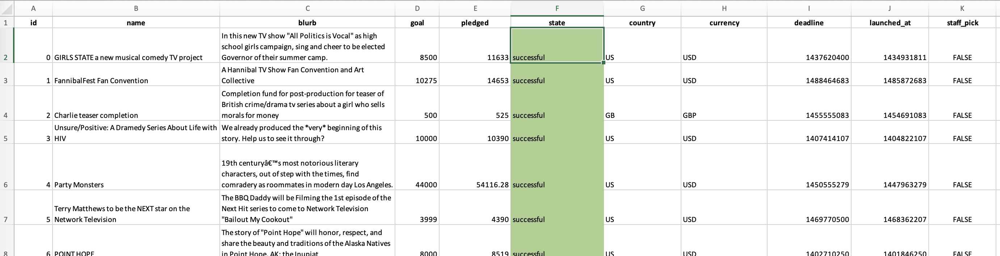
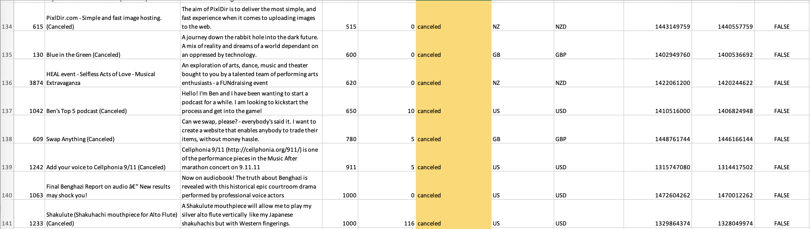
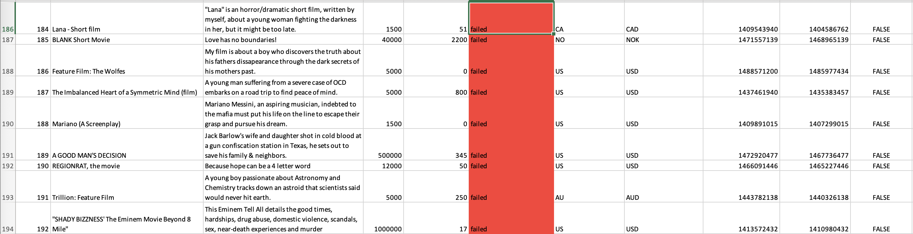
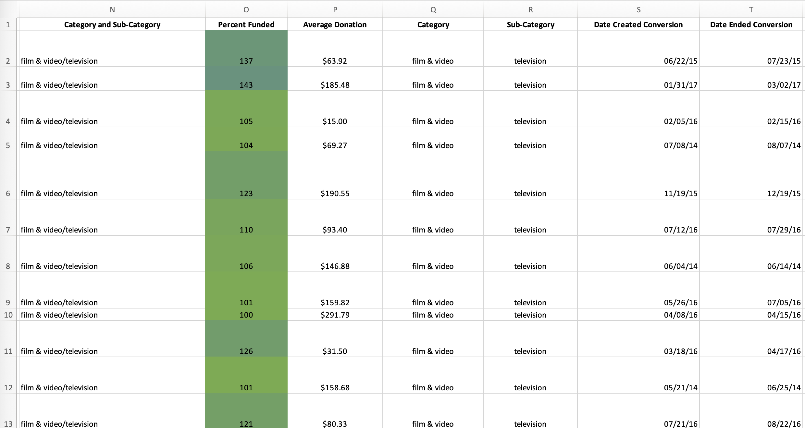
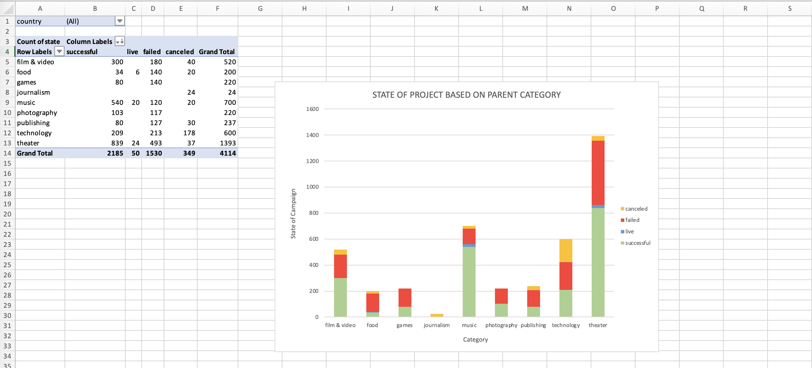
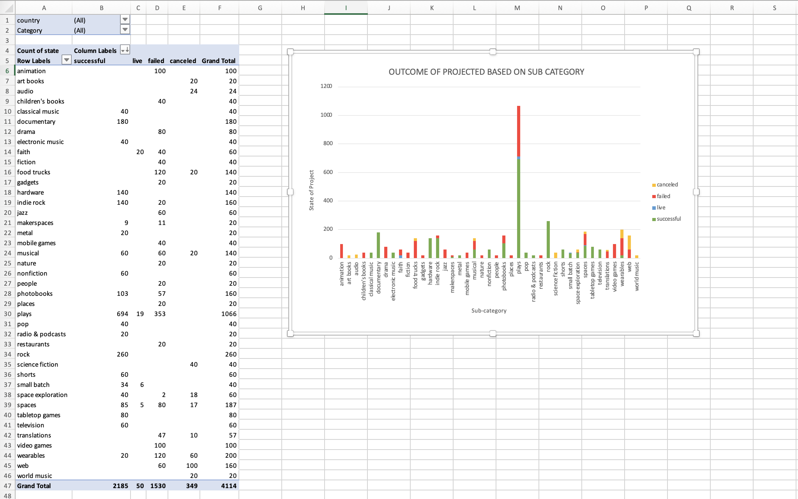
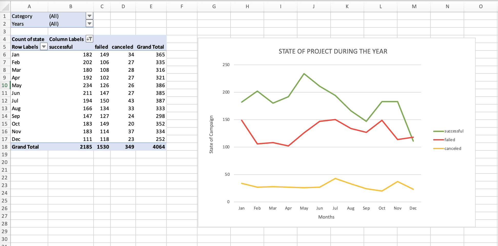
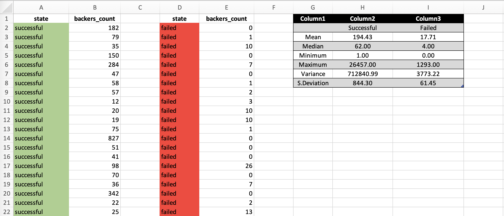
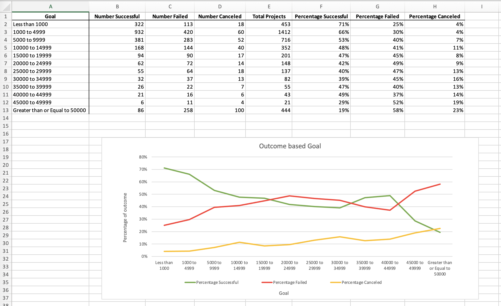

# **Excel Challenge: Kickstart My Chart**

<h3><b>Background</h3></b>

This project involves a provided database to modify and analyse the data of 4,000 past Kicksterter projects and attempt to uncover some market trends

<h3><b>Kickstarter Table</h3></b>

<li>Using conditional formatting to fill each cell in the "state" column with a different colour depending on where ther campaign was successful, failed, cancelled or currently live. 

 

 

<li>Using conditional formatting to fill each cell int the "Percent Funded" column using a three-colour scale

Scale starts with Dark red at 0, transitioning to Green at 100 and Blue at 200

 

 

<h3><b>Category and Sub-Category</h3></b>

Utilised pivot tables to count how many campaigns were successful, failed, cancelled or currently live based on Category and Sub-Category.
 
 
Visualised the data into bar charts:

<li>Created two more columns and used a formula to split the Category and Sub-Category columns into two parts
<li>Created Date Created Conversion and Date Ended Conversion columns and converted dates into Excel's date format

 
 

<h3><b>Outcome bases on Launch Date</h3></b>

 

<li>Created a pivot table with a column of state, rows of Date Created Conversion, values based on the count of state, and filters based on parent category and Years.

 
 

 

<h3><b>Bonus Analysis</h3></b>

Evaluated the following for successful and failed campaigns:

<li>The mean number of backers
<li>The median number of backers
<li>The minimum number of backers
<li>The maximum number of backers
<li>The variance number of backers
<li>The standard deviation number of backers

 
 

<li>Using the COUNTIFS() formula: count how many successful, failed, and canceled projects were created with goals within the ranges listed above. Populate the Number Successful, Number Failed, and Number Canceled columns with this data.
 
 

<li>Add up each of the values in the Number Successful, Number Failed, and Number Canceled columns to populate the Total Projects column. Then, using a mathematical formula, find the percentage of projects that were successful, failed, or canceled per goal range.
 
 

<h3><b>Conclusions</h3></b>
<ol><li>What are three conclusions we can draw about Kickstarter campaigns?
<li>What are some limitations of this dataset?
<li>What are some other possible tables and/or graphs that we could create?
 
 
Conclusions can be found in <a href=conclusions.txt > here.

